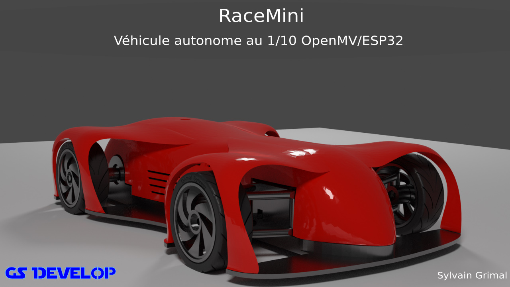
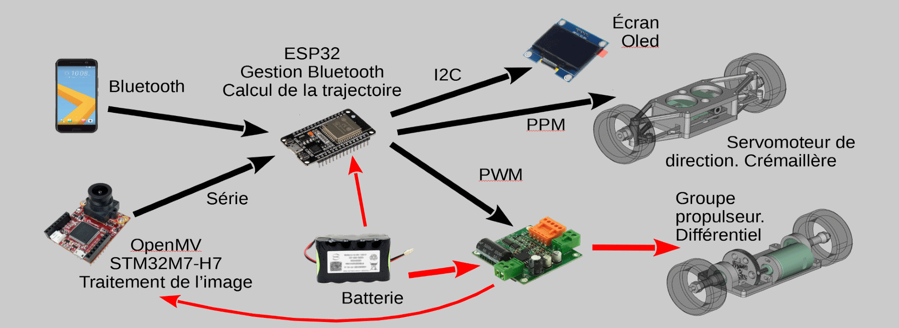
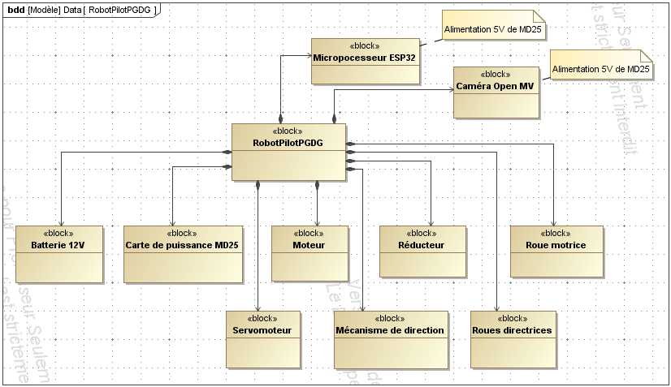

 

   
    
   Véhicule autonome au 1/10
   1/10 self driving car

##    1) Introduction

RaceMini est un véhicule au 1/10 d'étude sur la conduite autonome.
cliquer pour voir la vidéo sur youtube:

Le véhicule peut être piloté par un smartphone via une application Android et peut fonctionner en automatique ou manuel. Il utilise la reconnaissance des marquages au sol via la transformée de Hough sur une caméra openMV M7 ou H7 

 

Le modèle est entierement imprimable en 3D

**Dans le dépot RaceMini vous trouverez :**

* les fichiers CAO, STL pour imprimantes 3D 20 x 20 cm ou 30 x 30 cm
* L'APK Android pour le téléphone
* Le source ESP32 pour IDE Arduino
* Le source Python pour L'OpenMV

Non obligatoire:
* Les fichiers kiCad pour la fabrication d'un circuit imprimé: il rationalise le câblage avec des connecteurs pour chaque élément du système ( carte variateur, alim 5V, camera, écran )
* Des examples de traitement de l'image (transformée de Hough et régréssion) en java script (juste pour comprendre, non utilisés dans RaceMini)

L'ensemble est sous licence **CC BY-NC-SA**

**Les éléments suivants sont nécessaires:**

* Caméra OpenMV H7 (M7 possible) **attention à l'objectif le 2,8 mm d'origine possède un champ de vision un peu limité préférer un 2 ou 2.2 mm**
* ESP32 ( Il existe de nombreux modules le CI est prévu pour un ESP32 DEVKIT V1: 30 broches)
* Carte variateur (la carte DRI0042 dispose d'une sortie 5V régulée)
* Moteur type 540 et Pignon moteur
* batterie et interrupteur
* Visserie
* En option un écran Oled 1.3" monochrome **Attention selon le fabricant le GND et le 5V sont inversés !**

##    2) Structure matérielle.

 

la carte ESP32 reçoit les informations des marquages au sol détectés par la caméra via une liaison série et commande le moteur via une carte variateur ainsi que le servomoteur de direction.  L'application Android permet de commander le véhicule en manuel et de passer en mode automatique. En mode automatique la vitesse maximale est aussi fixée par le téléphone. 

##    2.1) Traitement de l’image

Le traitement de l’image est effectué par le microcontrôleur STM32H7 de la camera open H7. Il comprend plusieurs parties :

**Sélection des zones d’intérêt :**
Toutes les zones de l’image ne présentent pas les mêmes intérêts : un virage au loin informe qu’il faudra diminuer la vitesse avant de l’aborder (cette zone n’est pas analyser dans la version actuelle), par contre, la zone immédiatement devant votre véhicule détermine l’action sur la direction. On défini trois zones d’intérêts :
* Zone d’anticipation (bleu) *(non utilisée dans la version actuelle)*
* Zone marquage au sol droit (jaune)
* Zone marquage au sol gauche(vert)

 

Pour simplifier les zones sont rectangulaires et fixes.

* Détection des lignes dans les zones marquage au sol droit et gauche : L’algorithme utilise la transformée de Hough : chaque point sélectionné (contraste route grise et marquage blanc) sur l’écran est transformé en une sinusoïde représentant toutes les droites passant par ce point (distance de la droite par rapport à l’origine en fonction de l’angle de la droite) si plusieurs points sont alignés alors les sinusoïdes se croisent en un point image de la droite d’alignement. A l’issu de ce traitement on obtient un segment de droite pour le marquage au sol droit et un pour la gauche. Ils sont définis par les coordonnées (dans le repère de la camera) de leur extrémités.

NB : la transformée de Hough est une fonction déjà intégrée au Python de l’openMV mais un programme en javascript existe pour en comprendre le fonctionnement ( Attention les navigateurs Chrome, Firefox et le nouveau Edge -Chromium- ne supporte plus le traitement d'images sur disque, il faut charger la page html, le code javascript et l'image dans un serveur WEB)

* Calcul des segments dans le repère du véhicule à partir des coordonnées camera. Les points de la route sont supposés avoir une altitude nulle (terrain plat). Les quatre points sont ensuite transmis à l’ESP32 pour déterminer la conduite.

L’ensemble est programmé en python avec l’IDE openMV IDE.

##    2.2) Calcul de la commande de conduite.

La carte ESP32 reçoit les deux segments de droites des marquages au sol, elle détermine le CIR à partir de la médiane des deux segments (axe de la route) puis calcule les vitesses de la roue droite et de la roue gauche en fonction de la vitesse désirée (qui peut être diminuée si le virage est serré) :

L’ensemble est programmé dans l’IDE Arduino

Diagramme de bloc interne

 

##    2.3) Câblage

**Liasons ESP32 Caméra:**  
* RX ESP32 (RX2) / Tx caméra (P1 uart 1 Tx)  
* TX ESP32 (TX2) / Rx caméra (P0 uart 1 RX)

**Liaisons ESP32 Variateur:**  
* ESP32 D25 / PWM 
* ESP32 D33 / IN2  // Marche avant: 1 Marche arrière: 0  
* ESP32 D32 / IN1  // Marche avant: 0 Marche arrière: 1

**Liaisons ESP32 Ecran:**  
* ESP32 D21 / OLED SDA  
* ESP32 D22 / OLED SCL
						
**Et les alimentations:** Le 5v est fourni par la carte variateur sinon utiliser un module regulateur 5V à découpage

##   3) Vidéos
* [Présentation: https://youtu.be/Jysb8A-HKZk](https://youtu.be/Jysb8A-HKZk)
* [Marquages au sol partie 1: https://youtu.be/zz7oVWdyysM](https://youtu.be/zz7oVWdyysM)
* [Marquages au sol partie 2: https://youtu.be/7tqPUZ-_XuY](https://youtu.be/7tqPUZ-_XuY)
* [Modélisation caméra sténopé: https://youtu.be/YC57ygDgGVU](https://youtu.be/YC57ygDgGVU)
* [Conduite: https://youtu.be/9OizZml_HDY](https://youtu.be/9OizZml_HDY)
* [RaceMaxi: https://youtu.be/luEXLeMDnMg](https://youtu.be/luEXLeMDnMg)

